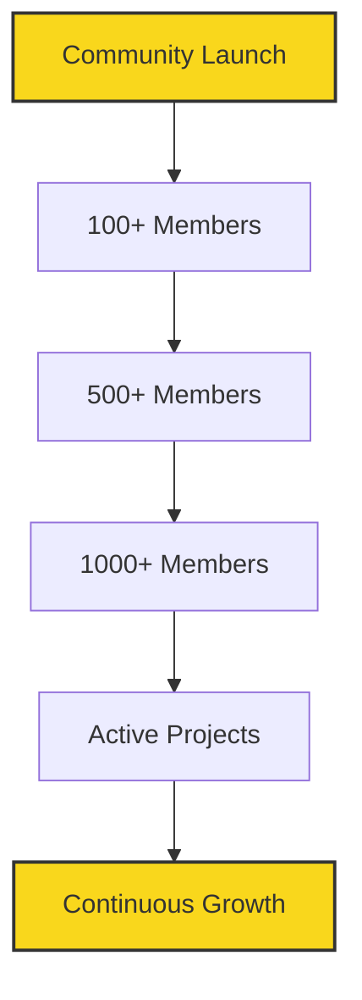

# Welcome to Telegram Developers Community

## About Us

We are a vibrant community of builders dedicated to enhancing the developer experience for the Telegram Mini Apps (TMA) platform. Our mission is to empower developers with cutting-edge tools, comprehensive documentation, and insightful tutorials.

### What We Do

- 🛠️ Develop tools to streamline TMA development
- 📚 Create and maintain up-to-date documentation
- 🎓 Provide tutorials and learning resources
- 🤝 Foster a collaborative environment for TMA developers

## Community Growth

## Featured Projects

| Project Name | Description | Status |
|--------------|-------------|--------|
| TMA CLI | Command-line tool for TMA development |  |
| TMA Docs | Comprehensive documentation for TMA |  |
| TMA Templates | Starter templates for quick development |  |

## Get Involved

We welcome contributions from developers of all skill levels. Here's how you can get involved:

1. 🌟 Star our repositories
2. 🐛 Report issues or suggest features
3. 🔧 Submit pull requests
4. 📢 Share your TMA projects with the community

## Connect With Us

- Website: [https://twa-dev.com](https://twa-dev.com)
- Telegram: [https://t.me/TeleDeveloperz](https://t.me/TeleDeveloperz)
- Email: contributor@twa-dev.com

## Location

🌎 Based in the United States of America

---

**Together, let's push the boundaries of what's possible with Telegram Mini Apps!**

