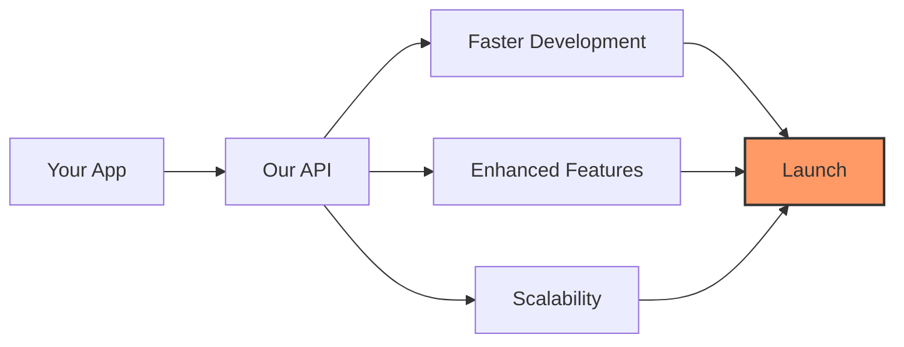

  

<h1 align="center">Telegram Developers Community</h1>

  
  
  

## 🚀 Our Mission

We empower developers to build exceptional Telegram Mini Apps and Web Apps. Our community provides free APIs, tools, and resources to enhance your development experience.

## 🛠️ What We Offer

- **Free APIs**: Accelerate your development with our robust, no-cost APIs
- **Developer Tools**: Streamline your workflow with our custom-built tools
- **Comprehensive Docs**: Access clear, concise documentation for all our offerings
- **Community Support**: Join a network of passionate Telegram app developers

## 📊 How Our API Helps You

## 🌟 Get Involved

1. **Star our repositories**: Show support and stay updated
2. **Follow our organization**: Never miss our latest tools and updates
3. **Contribute**: Join us in improving the Telegram development ecosystem
4. **Spread the word**: Help us grow this amazing community

## 📬 Connect With Us

- **Website**: [https://twa-dev.com](https://twa-dev.com)
- **Telegram**: [https://t.me/TeleDeveloperz](https://t.me/TeleDeveloperz)
- **Email**: contributor@twa-dev.com

  <i>Together, let's revolutionize Telegram app development!</i>

  

